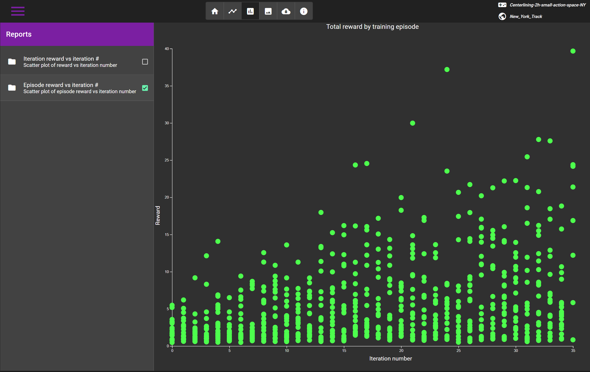
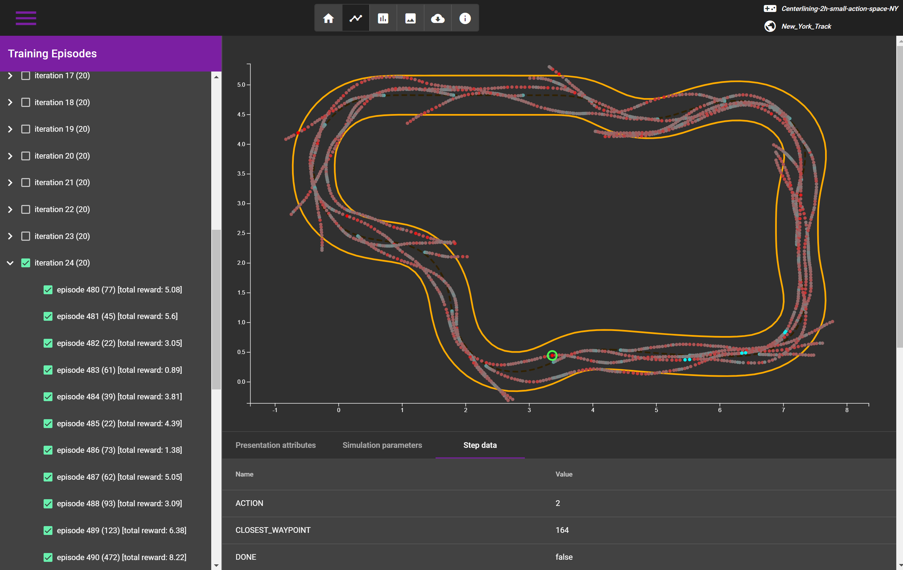
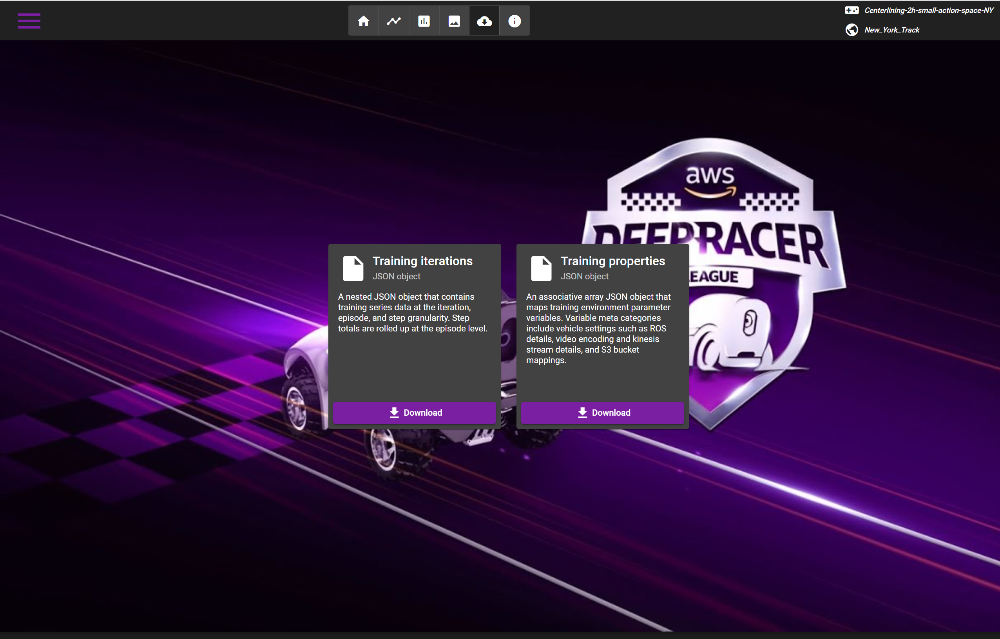

# DeepRacer Analyzer
> A browser based application to inspect DeepRacer model training performance logs

The DeepRacer Analyzer ingests DeepRacer CloudWatch model training logs and S3 model training artifacts to visualize the performance of model training runs. 
This application is in large part a web-based reproduction of the excellent AWS DeepRacer workshops [log analysis](https://github.com/aws-samples/aws-deepracer-workshops/tree/master/log-analysis) project
in an accessible format.

Link to the [sample app](https://soblenes32.github.io/deep-racer-analyzer/) on GitHub.

## Installation

Install [NPM](https://nodejs.org/en/)
Install the [Angular CLI](https://cli.angular.io/)
Clone the Github project to your local workstation

## Usage

Navigate to the project root and run "ng serve"